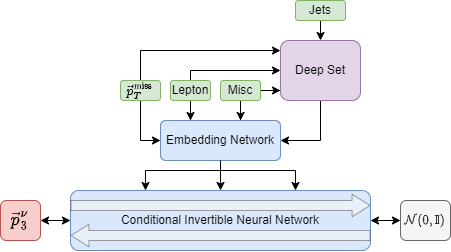

# Neutrino_Flows
A public repository for a minimal working example in the neutrino flows project

This repository facilitates the steps required the produce and save a fully trained
conditional normalising flow for neutrino regression.
- Associated paper: https://arxiv.org/abs/2207.00664
- Built using the pytorch and nflows libraries.

## Configuration

The entire session is configured by the tree yaml files which are found in config/
- data.yaml: Controls the data loading, where to file the files, which variables to use, which scalers to apply etc
- flow.yaml: Controls the configuration of the conditional INN, from the number of layers in the flow to the size of the deep set
- train.yaml: Controls the training set, here one can configure learning rate schedulers, gradient clipping, early stopping etc.
Each of these yaml files essentially define a hierarchy of keyword arguments which are passed to the functions in nureg/.
In each of these file there are extensive comments outlining what each option does.

## Setup

1) Setup the environment
    - Either use the requirement.txt file to setup the appropriate python packages.
        - This project was tested with python 3.9
    - Alternatively use the docker build file to create an image which can run the package
2) Download the data
    - The datafiles are a bit larger and thus are not stored in this repository
    - You can find them on Zenodo:
        - doi: 10.5281/zenodo.6782987
    - Make sure that the "path" keyword in config/train.yaml points to the downloaded folder
3) Specify the save path for the flow
    - This is done by setting the "base_kwargs/name" and "base_kwargs/save_dir" in config/flow.yaml
    - The code will try and create the directory if it does not exist
4) Run the script
    - Use simply "python train.py" and watch it go!

## What the train script does

The main executable script is train.py and it performs the following steps:
1) Loads in the three configuration dictionaries for the session
2) Initialises the dataset for training using the data config
3) Initialises the flow for training using the flow config and the dimensionality of samples in the dataset
4) Creates a save directory for the flow into which it stores:
    - Copies of the configs
    - Histograms of the raw dataset features
    - Preprocessing scalers, which are fit on the dataset
    - Histograms of the pre-processed dataset features
    - During training this will also be filled with the loss values, model checkpoints, and the "best" model based on lowest validation loss
5) Splits the dataset into a training and a holdout validation set
6) Initialises a Trainer using the train config, and starts the training session
    - The Trainer class performs model fitting via gradient descent
    - During this it facilitates moving data to and from the network device, checkpoint saving, early stopping etc.

